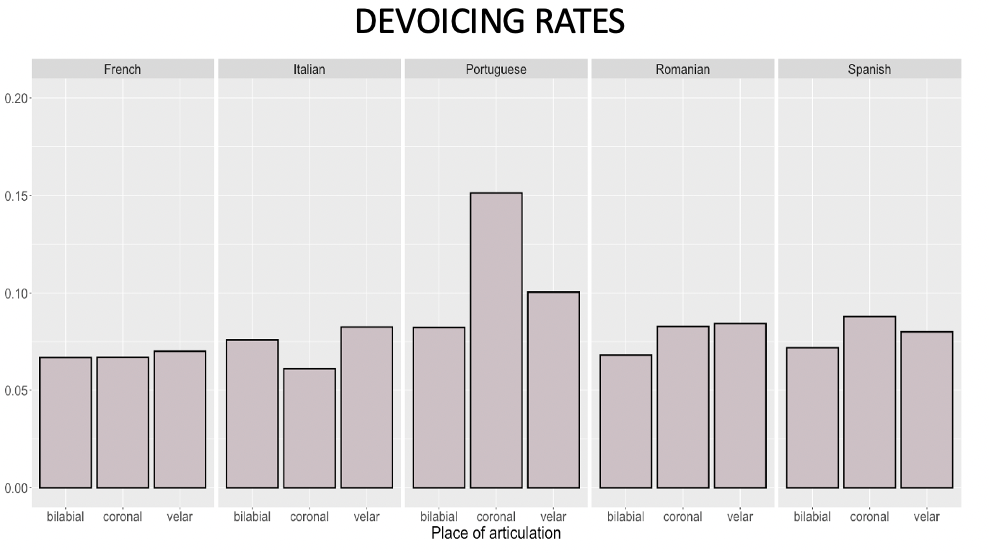
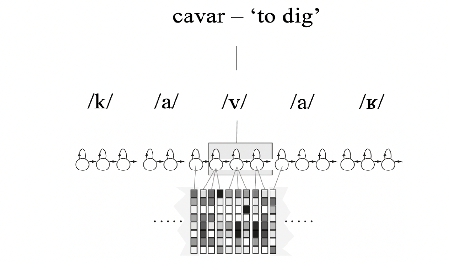

## Lenition and Fortition

    
    
This study investigates whether place of articulation plays a role in stop devoicing in five Romance languages using large
corpora and automatic alignment with pronunciation variants. [Popescu et al., 2023](Popescu_etal_ICPhS2023.pdf)

## Phonetic typology

    
    
The present study tests whether voicing in Europeant Portuguese (EP) fricatives diverges from its sister languages by using empirically motivated combinations of different languages
(EP, Italian, German) acoustic phone models on large EP corpora, allowing an ASR system to choose the best fitting one when force aligning the data. [preprint Popescu, Lamel & Vasilescu, 2023](Popescu_Lamel_Vasilescu_ICNLSP2023.pdf)

