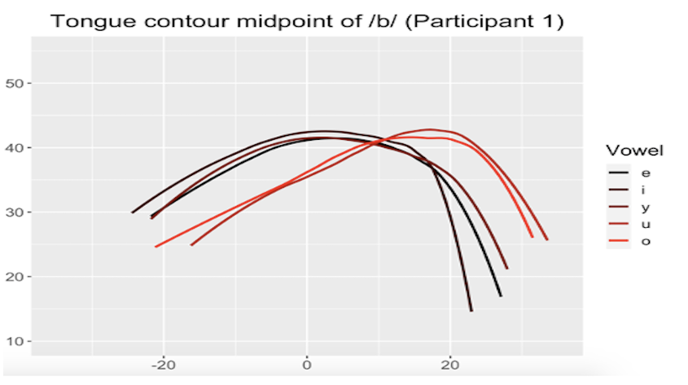

## Link between reading acquisition and coarticulation

    
    
This project investigates the relationship between reading acquisition and coarticulatory organization, a fundamental correlate of spoken language fluency,
in preliterate and beginning readers of German, a language which supports consistent grapheme-to-phoneme relationships. 
Results show that higher levels of phonological awareness, larger vocabulary and better reading skill are correlated with lower degrees of anticipatory coarticulation in CV sequences. ([Noiray, Popescu et al.,2019](https://www.frontiersin.org/articles/10.3389/fpsyg.2019.02777/full), [Popescu & Noiray, 2021](https://www.tandfonline.com/doi/full/10.1080/15475441.2021.1941032))

