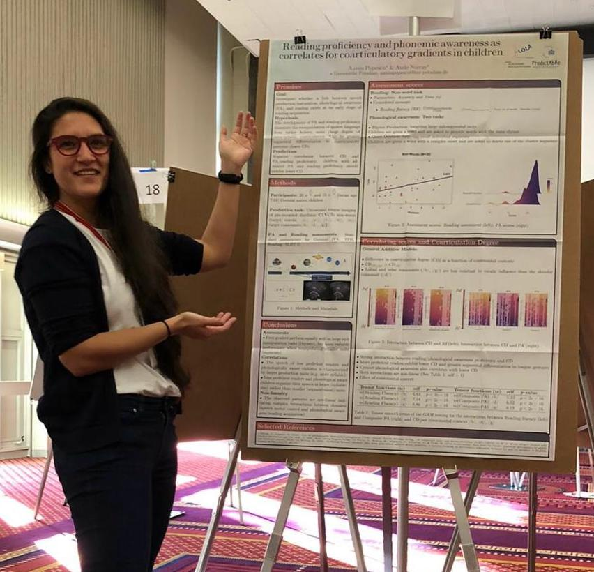

     
I have been Maître de Conférences (Associate Professor) in English phonetics and phonology at Université Paris 8 Vincennes Saint Denis since the start of this academic year (2025/26). My research uses a synergistic approach between laboratory phonology, speech technology and natural language processing to investigate the nature of speech production and cognitive representation units. I focus on the timing of gestural coordination patterns,
acoustic-articulatory relations and the cognitive representation of phonological and prosodic units. From a developmental perspective, I am interested in speech production in children, specifically how speech production interacts with segmental representation 
through metalinguistic skills such as reading proficiency.

    

See my [CV](AnisiaPopescu_CVEN_JAN2025.pdf){:target="_blank"} 
