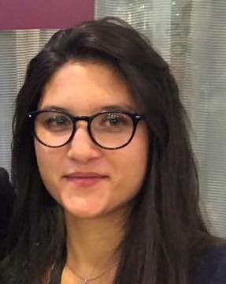

    
    
I am postdoctoral fellow in the [Science et Technologies des Langues](https://www.lisn.upsaclay.fr/recherche/departements-et-equipes/sciences-et-technologies-des-langues/) team at [LISN](https://www.lisn.upsaclay.fr/). 
My research uses a synergistic approach between laboratory phonology and automatic language processing to investigate the nature of speech production and cognitive representation units. I focus on the timing of gestural coordination patterns,
acoustic-articulatory relations and the cognitive representation of phonological and prosodic units. From a developmental perspective, I am interested in speech production in children, specifically how speech production interacts with segmental representation 
through metalinguistic skills such as reading proficiency.

{: .align-left}
I am postdoctoral fellow in the [Science et Technologies des Langues](https://www.lisn.upsaclay.fr/recherche/departements-et-equipes/sciences-et-technologies-des-langues/) team at [LISN](https://www.lisn.upsaclay.fr/). 
My research uses a synergistic approach between laboratory phonology and automatic language processing to investigate the nature of speech production and cognitive representation units. I focus on the timing of gestural coordination patterns,
acoustic-articulatory relations and the cognitive representation of phonological and prosodic units. From a developmental perspective, I am interested in speech production in children, specifically how speech production interacts with segmental representation 
through metalinguistic skills such as reading proficiency.
